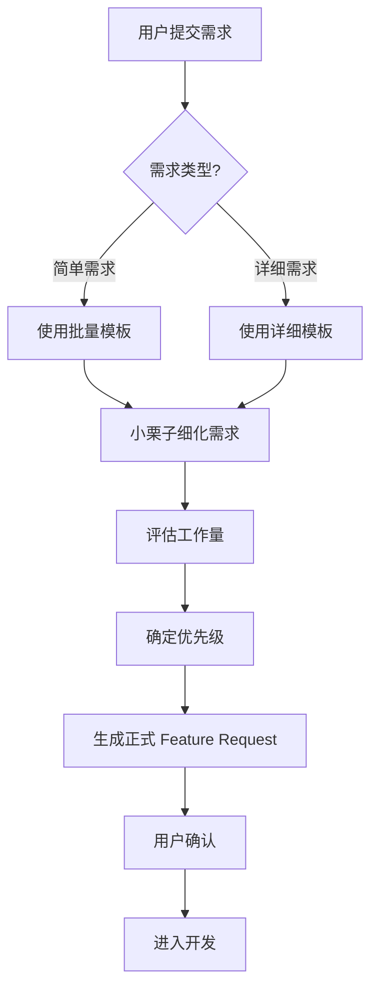

# Tracker 开发流程规范

> **版本**: v1.0 | **创建日期**: 2026-02-05 | **状态**: 生效

---

## 目录

1. [概述](#1-概述)
2. [Git 分支管理](#2-git-分支管理)
3. [需求提交流程](#3-需求提交流程)
4. [开发流程](#4-开发流程)
5. [测试流程](#5-测试流程)
6. [发布流程](#6-发布流程)
7. [文档规范](#7-文档规范)

---

## 1. 概述

### 1.1 目的

本文档定义了 Tracker 项目的开发流程规范，确保团队协作高效、代码质量可控、版本发布可追溯。

### 1.2 适用范围

- 所有参与 Tracker 项目开发的人员
- 代码提交、评审、发布流程

### 1.3 核心原则

| 原则 | 说明 |
|------|------|
| **代码隔离** | Git 只维护 dev/ 代码，发布到独立目录 |
| **数据安全** | 用户数据与测试数据物理隔离 |
| **流程规范** | 需求 → 开发 → 测试 → 发布 |

---

## 2. Git 分支管理

### 2.1 分支结构

```
main (稳定代码，对应 /release/tracker/current)
│
├── develop (开发主分支，存放 dev/ 代码)
│   ├── feature/* (功能开发分支)
│   ├── release/* (发布分支)
│   └── hotfix/* (紧急修复分支)
│
└── tags (在 main 分支上创建)
```

### 2.2 分支说明

| 分支 | 来源 | 合并到 | 用途 |
|------|------|--------|------|
| **main** | - | - | 生产环境代码 |
| **develop** | main | - | 开发主分支 |
| **feature** | develop | develop | 新功能开发 |
| **release** | develop | main + develop | 发布准备 |
| **hotfix** | main | main + develop | 紧急修复 |

### 2.3 常用命令

```bash
# 查看所有分支
git branch -a

# 创建功能分支
git checkout develop
git checkout -b feature/user-auth

# 合并功能分支
git checkout develop
git merge feature/user-auth --no-ff -m "feat: 添加用户认证"

# 创建标签
git checkout main
git tag -a v0.4.0 -m "Release v0.4.0"

# 查看提交历史
git log --oneline --graph --all
```

---

## 3. 需求提交流程

### 3.1 需求类型

| 类型 | 说明 | 模板 |
|------|------|------|
| **新功能** | 新增功能模块 | TEMPLATE_FEATURE_REQUEST.md |
| **批量需求** | 多个简单需求 | BATCH_REQUESTS_TEMPLATE.md |
| **Bug 修复** | 修复缺陷 | BugLog |

### 3.2 需求提交流程

```
┌─────────────────────────────────────────────────────────────────┐
│                        需求提交流程                               │
├─────────────────────────────────────────────────────────────────┤
│                                                                  │
│  1️⃣ 用户提交需求                                                │
│     └── 填写模板 → 放到 /projects/management/feedbacks/new/     │
│                                                                  │
│  2️⃣ 需求评审                                                    │
│     └── 小栗子细化 → 评估工作量 → 确定优先级                    │
│                                                                  │
│  3️⃣ 需求确认                                                    │
│     └── 生成正式文档 → 用户确认 → 进入开发                      │
│                                                                  │
│  4️⃣ 开发实现                                                    │
│     └── Git 分支 → 编码 → 测试 → 提交                          │
│                                                                  │
│  5️⃣ 发布上线                                                    │
│     └── 执行 release.py → 切换版本 → 重启服务                   │
│                                                                  │
└─────────────────────────────────────────────────────────────────┘
```

### 3.3 需求模板

#### 3.3.1 单个详细需求

```bash
# 使用模板
cp /projects/management/feedbacks/new/TEMPLATE_FEATURE_REQUEST.md \
   /projects/management/feedbacks/new/功能名称_YYYYMMDD.md
```

**模板位置**: `/projects/management/feedbacks/new/TEMPLATE_FEATURE_REQUEST.md`

#### 3.3.2 批量简单需求

```bash
# 使用批量模板
cp /projects/management/feedbacks/new/BATCH_REQUESTS_TEMPLATE.md \
   /projects/management/feedbacks/new/REQUESTS_YYYYMMDD.md
```

**模板位置**: `/projects/management/feedbacks/new/BATCH_REQUESTS_TEMPLATE.md`

### 3.4 需求处理流程



### 3.5 需求存放位置

| 类型 | 目录 |
|------|------|
| 新需求 | `/projects/management/feedbacks/new/` |
| 已评审需求 | `/projects/management/feedbacks/reviewed/` |
| 开发中需求 | `/projects/management/feedbacks/in-progress/` |
| 已完成需求 | `/projects/management/feedbacks/completed/` |

---

## 4. 开发流程

### 4.1 日常开发流程

```bash
# 1. 确保开发分支最新
git checkout develop
git pull origin develop

# 2. 创建功能分支
git checkout -b feature/功能名称

# 3. 开发实现
#    - 修改 dev/ 目录下的代码
#    - 在 dev 版本测试

# 4. 提交代码
git add .
git commit -m "feat: 功能说明"

# 5. 合并到 develop
git checkout develop
git merge feature/功能名称 --no-ff -m "merge: 合并功能名称"

# 6. 推送
git push origin develop
```

### 4.2 开发环境

| 项目 | 配置 |
|------|------|
| **开发版** | `dev/` 目录，端口 8081，test_data |
| **测试数据** | `/projects/management/tracker/shared/data/test_data/` |
| **启动命令** | `cd dev && python3 server_test.py` |

### 4.3 代码规范

#### 4.3.1 提交信息规范

```
<type>: <subject>

<body>

<footer>
```

**Type 类型**:

| 类型 | 说明 | 示例 |
|------|------|------|
| feat | 新功能 | `feat: 添加用户认证功能` |
| fix | Bug 修复 | `fix: 修复项目切换数据丢失问题` |
| docs | 文档更新 | `docs: 更新规格书` |
| style | 代码格式 | `style: 格式化代码` |
| refactor | 重构 | `refactor: 重构 API 结构` |
| test | 测试 | `test: 添加单元测试` |
| chore | 构建/工具 | `chore: 更新依赖版本` |

#### 4.3.2 代码质量

- Python 代码遵循 PEP 8
- 前端代码保持简洁
- 关键函数添加注释

---

## 5. 测试流程

### 5.1 测试类型

| 测试类型 | 执行方式 | 覆盖范围 |
|----------|----------|----------|
| **单元测试** | pytest | API 接口 |
| **Playwright 测试** | UI 自动化 | 核心功能 |
| **手动测试** | 人工验收 | 界面体验 |

### 5.2 测试执行

```bash
# API 测试 (dev 版本)
cd dev
PYTHONPATH=. pytest tests/test_api.py -v

# Playwright 冒烟测试
cd dev
npx playwright test tests/test_smoke.spec.ts --project=firefox

# BugLog 回归测试
cd dev
npx playwright test tests/tracker.spec.ts --project=firefox
```

### 5.3 测试数据

| 版本 | 数据目录 | 说明 |
|------|----------|------|
| **dev** | `test_data/` | 测试数据，与用户数据隔离 |
| **stable** | `user_data/` | 用户真实数据，只读验证 |

---

## 6. 发布流程

### 6.1 发布前检查清单

```bash
# 1. dev 版本测试全部通过 ✅
cd dev && PYTHONPATH=. pytest tests/test_api.py -v

# 2. Playwright 测试通过 ✅
cd dev && npx playwright test tests/ --project=firefox

# 3. Git 代码已合并到 develop ✅
git checkout develop && git status

# 4. 创建发布标签
git checkout main
git merge develop
git tag -a v0.4.0 -m "Release v0.4.0"
```

### 6.2 执行发布

```bash
cd /projects/management/tracker

# 演练模式（推荐先执行）
python3 scripts/release.py --dry-run

# 实际发布
python3 scripts/release.py --version v0.4.0 --force
```

### 6.3 发布后验证

```bash
# 检查服务状态
sudo systemctl status tracker

# 验证 API
curl http://localhost:8080/api/version
```

### 6.4 回滚

```bash
# 方式1：使用发布脚本回滚
cd /projects/management/tracker
python3 scripts/release.py --rollback --force

# 方式2：手动切换版本
sudo rm /release/tracker/current
sudo ln -s /release/tracker/v0.3.x /release/tracker/current
sudo systemctl restart tracker
```

---

## 7. 文档规范

### 7.1 文档类型

| 类型 | 文件名 | 说明 |
|------|--------|------|
| 规格书 | `tracker_规格书_v0.3.md` | 功能定义、架构设计 |
| 测试计划 | `tracker_测试计划.md` | 测试策略、用例 |
| 发布报告 | `TRACKER_TEST_REPORT_*.md` | 测试结果 |
| 功能需求 | `FEATURE_*.md` | 新功能详细定义 |
| 开发规范 | `DEVELOPMENT_PROCESS.md` | 本文档 |

### 7.2 文档存放位置

```
/projects/management/tracker/docs/
├── dev/                  # 开发相关文档
│   ├── tracker_规格书_v0.3.md
│   ├── tracker_测试计划.md
│   ├── DEVELOPMENT_PROCESS.md
│   ├── TEMPLATE_FEATURE_REQUEST.md
│   └── TEMPLATE_RELEASE_NOTES.md
│
└── user/                  # 用户文档
    └── user_manual.md
```

### 7.3 版本历史

每次发布或重大变更后更新本文档版本号。

---

## 附录 A: 快速参考

### Git 命令速查

```bash
# 分支操作
git branch -a              # 查看所有分支
git checkout develop       # 切换到 develop
git checkout -b feature/xxx # 创建功能分支
git branch -d feature/xxx  # 删除分支

# 代码提交
git add .
git commit -m "feat: xxx"
git push origin develop

# 标签操作
git tag -a v0.4.0 -m "Release v0.4.0"
git push origin main --tags
```

### 发布命令速查

```bash
# 演练
python3 scripts/release.py --dry-run

# 发布
python3 scripts/release.py --version v0.4.0 --force

# 回滚
python3 scripts/release.py --rollback --force
```

### 服务管理

```bash
# 重启服务
sudo systemctl restart tracker

# 查看状态
sudo systemctl status tracker

# 查看日志
journalctl -u tracker -f
```

---

**文档版本**: v1.0  
**最后更新**: 2026-02-05  
**维护者**: 小栗子 🌰
